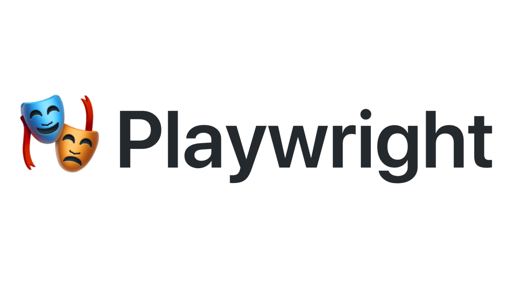

# Playwright + axe-core (axe API)




## _Let's go started:_

**_First of all, you need to clone project from repository ->_**
```bash
git clone https://github.com/1nk1/axe-core-playwright.git
cd axe-core-playwright
```

**_Second, you need to install packages ->_**

```bash
yarn install
```

**_So, we should to start test from this project ->_**

###### To run UI tests -> 
```bash
npm run tests
```

###### To run UI tests and create Allure reports ->
```bash
npm run report
```

**_About for run testing on CLI (axe-core) ->_**:
```bash
cd cli
npm run prebuild
npm run test
```
**_You could to views coverage each test ->_**:

```bash
npm run coverage
```
Thanks for visiting us ;))